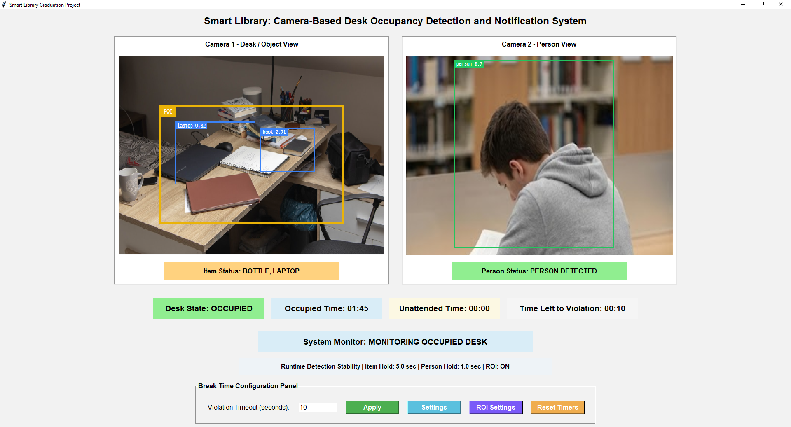
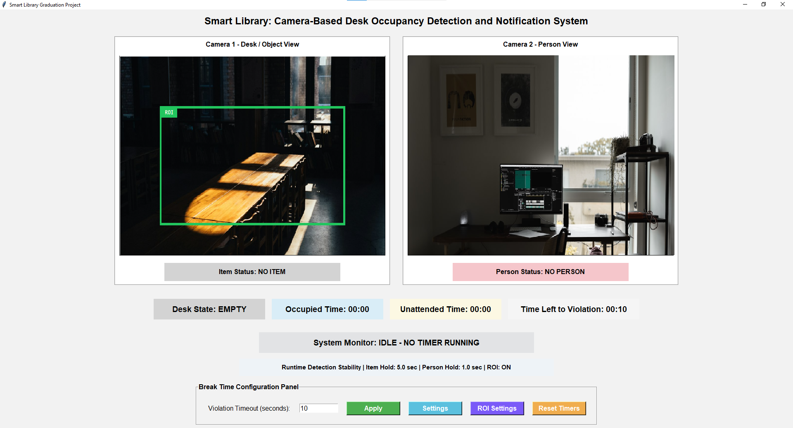
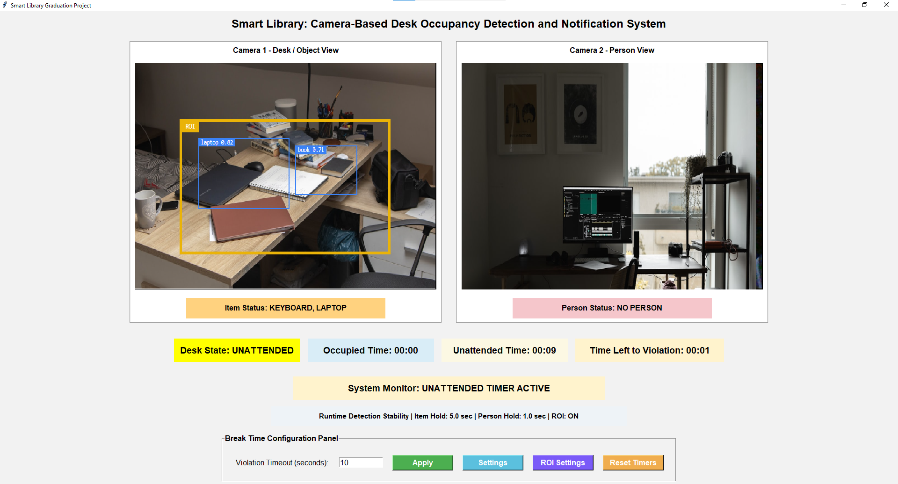
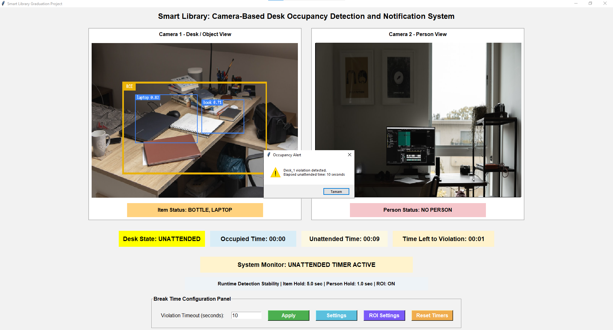
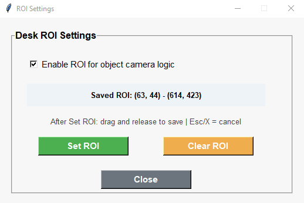
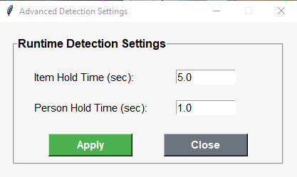

# Smart Library



Smart Library is a computer vision-based desktop application developed to monitor study desk occupancy in libraries.

The system uses the YOLOv8n object detection model to detect people and predefined object classes representing personal belongings on study desks. Based on the detected objects and human presence, each desk is classified into one of the following states:

- EMPTY
- OCCUPIED
- UNATTENDED
- VIOLATION

When a desk remains unattended longer than the configured timeout period, the system displays a warning pop-up and records the event in a log file.

---

## Features

- Real-time person and object detection using YOLOv8n
- Study desk occupancy monitoring
- ROI (Region of Interest) selection
- Configurable timeout settings
- Pop-up violation notifications
- CSV-based event logging
- JSON-based configuration management
- Offline operation after the initial model download
- Tkinter desktop interface

---

## Screenshots

### EMPTY State



### OCCUPIED State


### UNATTENDED State



### VIOLATION State



### ROI Settings



### Application Settings



---

## Technologies

- Python
- YOLOv8n (Ultralytics)
- PyTorch
- OpenCV
- Tkinter
- Pillow
- NumPy
- JSON
- CSV

---

## Project Structure

```text
Smart Library Graduation Project/
│
├── core/
│   ├── config_manager.py
│   ├── detector.py
│   ├── logger.py
│   ├── roi_selector.py
│   └── state_manager.py
│
├── ui/
│   ├── main_window.py
│   ├── roi_window.py
│   ├── settings_window.py
│   └── ui_helpers.py
│
├── screenshots/
│   ├── 1-empty.png
│   ├── 2-occupied.png
│   ├── 3-unattended.png
│   ├── 4-violation.png
│   ├── 5-roisettings.png
│   └── 6-settings.png
│
├── app.py
├── config.json
├── yolov8n.pt
├── requirements.txt
├── README.md
└── .gitignore
```

---

## Desk States

| State | Description |
|-------|-------------|
| **EMPTY** | No person and no monitored object are detected. |
| **OCCUPIED** | A person is detected at the desk. |
| **UNATTENDED** | Personal belongings remain while no person is detected. |
| **VIOLATION** | The unattended timeout has been exceeded. |

---

## Alert System

When the configured timeout is exceeded:

1. The desk state changes to **VIOLATION**.
2. A warning pop-up is displayed.
3. The event is recorded in **logs.csv**.
4. The timer is reset after the user acknowledges the warning.

---

## Configuration

Application settings are stored in:

```text
config.json
```

The configuration file allows timeout values, ROI coordinates, confidence thresholds and other application settings to be modified without changing the source code.

---

## Logging

Detected events are automatically recorded in:

```text
logs.csv
```

The log file is generated automatically while the application is running.

---

## Running from Source

Install the required dependencies:

```bash
pip install -r requirements.txt
```

Run the application:

```bash
python app.py
```

---

## Windows Executable

A standalone Windows executable is available in the **Releases** section of this repository.

To run the application:

1. Download the latest release.
2. Keep **SmartLibrary.exe** and **config.json** in the same folder.
3. Run **SmartLibrary.exe**.

A separate Python installation is **not required**.

---

## Offline Operation

After the YOLO model (`yolov8n.pt`) has been downloaded once, the application runs completely offline and does not require an internet connection.

---

## Notes

This project was developed as a **Proof of Concept (PoC)** graduation project.

The application performs all processing locally and does not store camera images or video recordings.